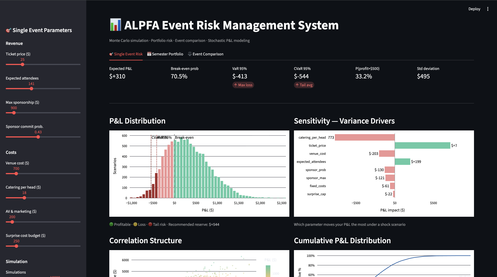

# ALPFA Event Risk Management System

Models financial risk of student organization events using Monte Carlo simulation with correlated outcomes, producing event-level and portfolio-level risk metrics for operational decision-making.

> Built as a practical risk analytics tool for UT ALPFA chapter leadership and as a demonstration of quantitative finance methods applied to real organizational data.

---

## What It Does

```
simulation.py → portfolio.py → comparison.py → app.py (Streamlit dashboard)
```

| Module | Purpose |
|---|---|
| `simulation.py` | Single-event Monte Carlo engine — P&L distribution, VaR, CVaR, sensitivity |
| `portfolio.py` | Semester portfolio — correlated event outcomes, diversification benefit |
| `comparison.py` | Format comparison — Sharpe, Sortino, Calmar, P(A beats B) |
| `app.py` | Interactive 3-tab Streamlit dashboard |

---

## Key Outputs

- Expected P&L per event with confidence intervals
- 95% VaR and CVaR (recommended cash reserve)
- Semester portfolio VaR vs sum of individual VaRs (diversification benefit)
- Cross-event correlation matrix
- Risk-adjusted format comparison (Sharpe / Sortino / Calmar scoring)
- Sensitivity tornado: which variable drives P&L variance most

---

## Modeling Techniques

| Technique | Implementation | File |
|---|---|---|
| Poisson distribution | Attendance simulation (count data) | `simulation.py` |
| Bernoulli × LogNormal | Sponsorship — binary commit × variable payout | `simulation.py` |
| Pareto tail (α=2.5) | Rare surprise cost shocks (fat-tailed) | `simulation.py` |
| PERT distribution | Bounded catering cost (min / mode / max) | `simulation.py` |
| Cholesky decomposition | Correlated attendance ↔ revenue (single event) | `simulation.py` |
| Full Cholesky factor matrix | Cross-event P&L correlation (portfolio) | `portfolio.py` |
| Antithetic variate sampling | Variance reduction — mirrors each random draw | `simulation.py` |
| One-at-a-time sensitivity | Ranks which input drives P&L variance most | `simulation.py` |
| VaR / CVaR (95%) | Downside risk quantification | `simulation.py`, `portfolio.py` |
| Sharpe / Sortino / Calmar | Risk-adjusted event format scoring | `comparison.py` |
| P(A beats B) | Pairwise scenario-level outperformance probability | `comparison.py` |

---

## Financial Interpretation

| This System | Finance Equivalent |
|---|---|
| Event P&L | Single asset return |
| Semester of events | Investment portfolio |
| Cross-event correlation | Asset correlation matrix |
| Portfolio VaR < sum of VaRs | Diversification benefit |
| Sponsor dropout | Counterparty / credit risk |
| Antithetic variates | Variance reduction (standard in derivatives pricing) |
| Format comparison (Sharpe-ranked) | Competing investment strategies |

---

## Setup

```bash
pip install -r requirements.txt
streamlit run app.py
```

---

## Practical Use Cases

- **Pre-event go/no-go** — break-even probability and worst-case reserve before committing to a venue deposit
- **Sponsor pitch** — show a sponsor how their contribution shifts break-even probability (e.g. 55% → 82%)
- **Semester planning** — portfolio-level reserve sizing across all events, not just one at a time
- **Format decisions** — in-person vs hybrid vs virtual, decided by risk-adjusted data not gut feeling

---

## Dashboard Preview



---

## Tech Stack

Python · NumPy · SciPy · Streamlit · Plotly